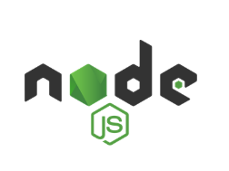
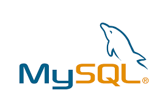
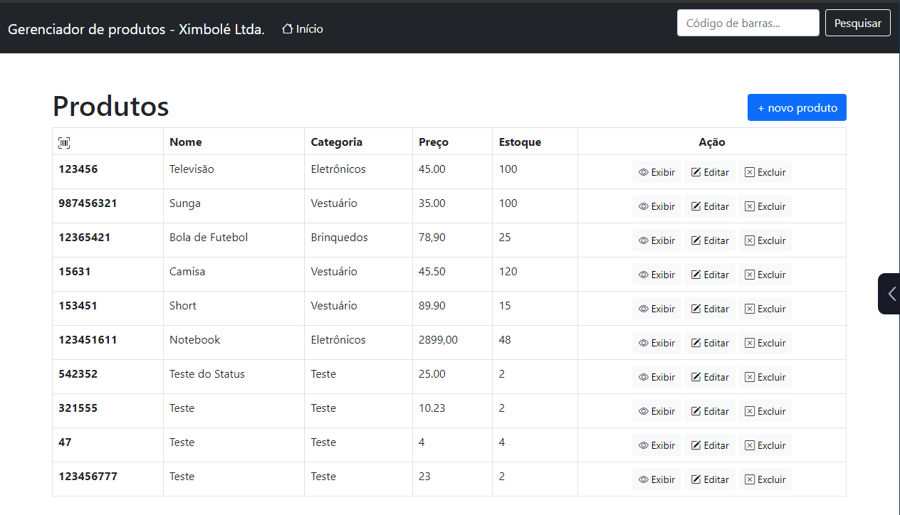
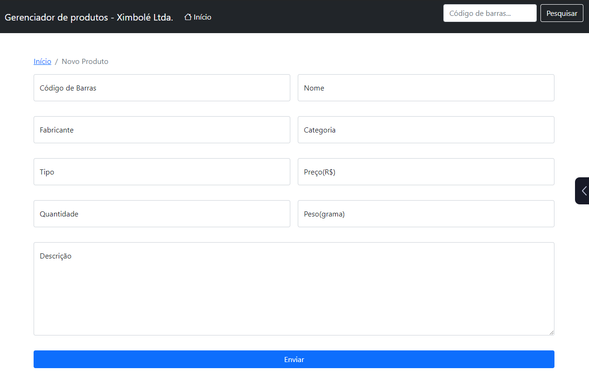

# Projeto para gerenciar produtos

### Requisitos

&nbsp;&nbsp;&nbsp;
&nbsp;&nbsp;&nbsp;

### Instale as dependências

~~~~javascript
npm install dotenv
npm install express
npm install express-handlebars
npm install mysql
~~~~

&nbsp;&nbsp;&nbsp;
&nbsp;&nbsp;&nbsp;
&nbsp;&nbsp;&nbsp;
&nbsp;&nbsp;&nbsp;

### 2. Depois crie um banco de dados na sua máquina com o conteúdo do arquivo "tabela-produtos.sql"

Pronto! agora é só abrir o [localhost](localhost:5000) na sua máquina.
# Preview do Gerenciador

