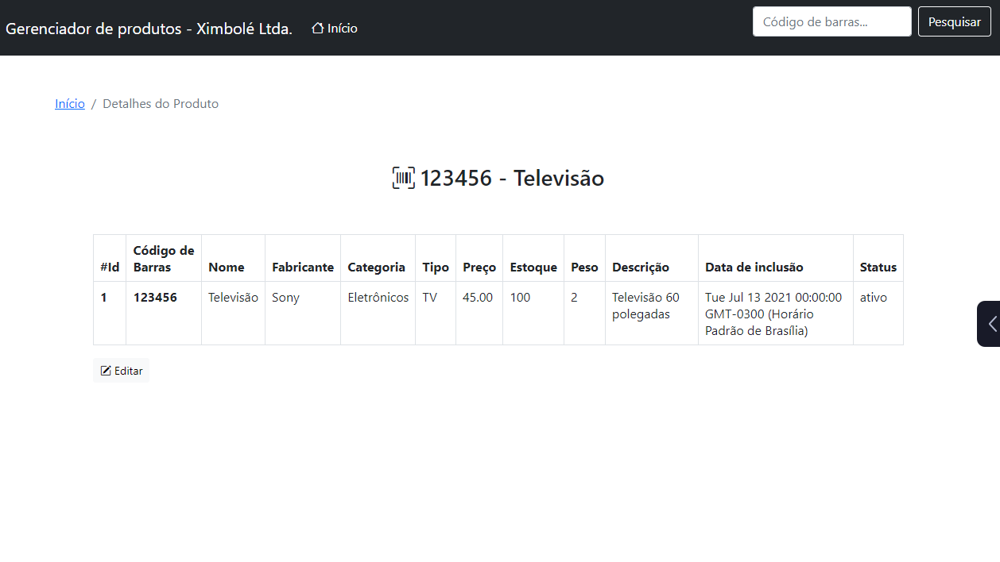

# Projeto para gerenciar produtos

## Requisitos

&nbsp;&nbsp;&nbsp;

## Instale as dependências

~~~~javascript
npm install dotenv
npm install express
npm install express-handlebars
npm install mysql
~~~~

## 2. Depois crie um banco de dados na sua máquina com o conteúdo

tabela-produtos.sql

## 2. Depois crie um banco de dados na sua máquina com o conteúdo

